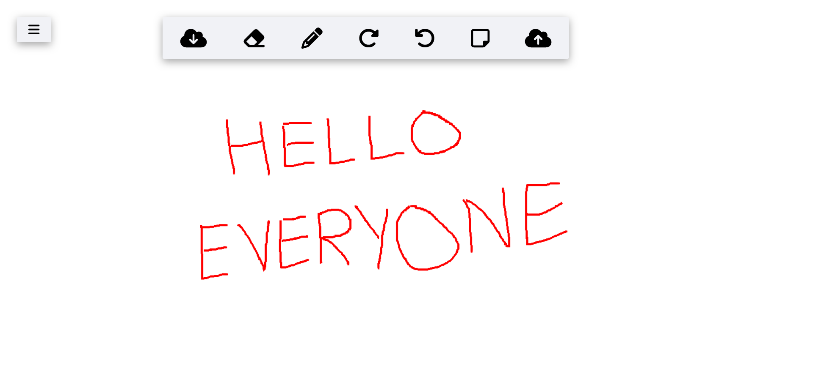

# Sketch Baord 2.0

## Tech Stack
**Frontend** : HTML, CSS, JavaScript  
**Canvas Handling** : Canvas API for drawing  
**Real-Time Collaboration** : Socket.io for live sharing  
**Backend** : Express.js for server  
**User Experience** : Drag and Drop API for intuitive interactions

## Key Features
**Digital Sketch Board** : An interactive canvas for drawing and creativity.  
**Drawing Tools**: Choose from a variety of shapes, colors, and sizes for your creations.  
**Editing Ease**: Includes an eraser and undo-redo functionality for precise control.  
**Side Notes** : Upload images to reference while drawing.  
**Streamlined Organization** : Easily minimize or remove side notes for a clean workspace.  
**Collaboration** : Collaborate in real-time, sharing your creative process with others.  
**Export** : Download and save your artwork for future use and sharing.  

You can checkout app here [Live Deploy Link](https://sketch-board-sfvz.onrender.com/)

You can reach out to me on linkedin, this is my profile [LinkedIn](https://www.linkedin.com/in/kapil-kharera-191b83245/)

*NOTE* : Please feel free to provide feedback on my work.
